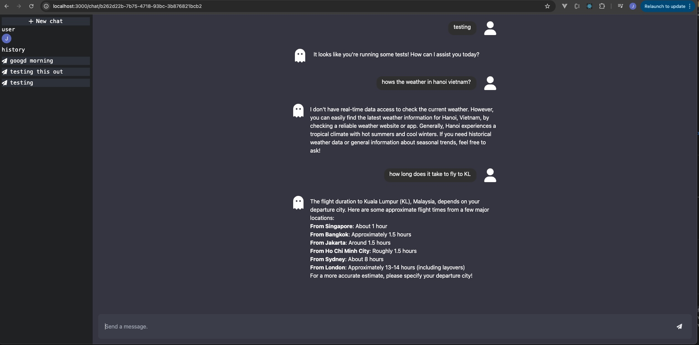
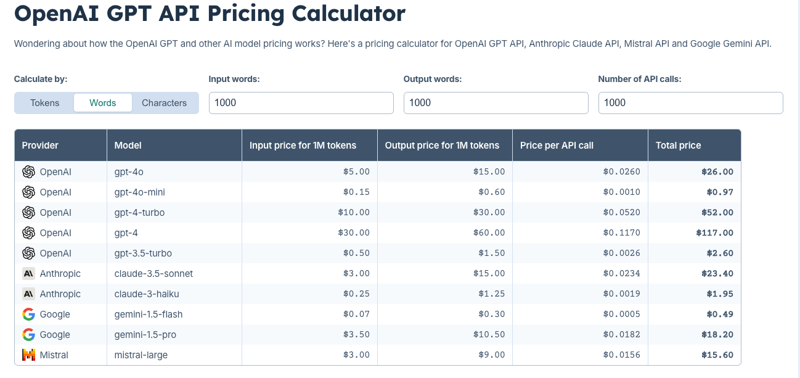
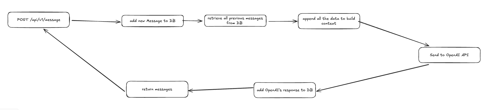
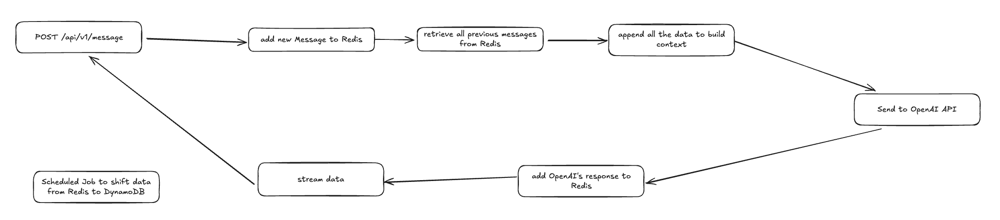

<!-- Improved compatibility of back to top link: See: https://github.com/othneildrew/Best-README-Template/pull/73 -->

<a id="readme-top"></a>

<!-- PROJECT LOGO -->
<br />
<div align="center">

  <h3 align="center">Chat</h3>

  <p align="center">
    B Capital Chatbot
    <br />
    
  </p>
</div>

  <summary>Table of Contents</summary>
<ol>
  <li>
    <a href="#about-the-project">About The Project</a>
  </li>
  <li>
    <a href="#decisions">Decisions</a>
    <ul>
      <li><a href="#1-which-llm-model-to-use">Which LLM Model to Use?</a></li>
      <li><a href="#2-backend-framework-of-choice">Backend Framework of Choice</a></li>
      <li><a href="#3-db-choice-and-structure">DB Choice and Structure</a></li>
      <li><a href="#4-authentication-clerk">Authentication: Clerk</a></li>
      <li><a href="#5-brief-system-design">Brief System Design</a></li>
      <li><a href="#6-potential-improvements">Potential Improvements</a></li>
    </ul>
  </li>
  <li>
    <a href="#getting-started">Getting Started</a>
    <ul>
      <li><a href="#prerequisites">Prerequisites</a></li>
      <li><a href="#installation">Installation</a></li>
    </ul>
  </li>

  </ol>

<!-- ABOUT THE PROJECT -->

## About The Project

Objective: Create a chatbot application that lets users interact with Al language models (like ChatGPT or Claude). This project should showcase your ability to build a complete web application with proper authentication, data persistence, and a polished user.

DEMO (https://www.job-seow-chatbot.com/) (just-in-case: https://chatbot-ten-phi-12.vercel.app/)



<p align="right">(<a href="#readme-top">back to top</a>)</p>

# Decisions

Using this space to show the architectural decisions made and why

## 1. Which LLM Model to use?

| API (OpenAI GPT)                                                                                                                           | API (Antrophic Claude)                                                                                                        | API (Google Gemini)                                                                                                   | Open-Source (Meta LLaMA/Hugging Face)                                                                                                                                                                  |
| ------------------------------------------------------------------------------------------------------------------------------------------ | ----------------------------------------------------------------------------------------------------------------------------- | --------------------------------------------------------------------------------------------------------------------- | ------------------------------------------------------------------------------------------------------------------------------------------------------------------------------------------------------ |
| - **Strengths**: High language fluency, pre-trained knowledge, API support.<br>- **Cons**: Usage costs and limited fine-tuning options<br> | - **Strengths**: Emphasizes safe and ethical outputs, good at reasoning.<br>- **Cons**: Limited fine-tuning capabilities.<br> | - Strengths:<br>Gemini can process and generate both text and images<br>- **Cons**: Limited fine-tuning capabilities. | - **Strengths**: Community-supported, open-source, a large variety of pre-trained models.<br><br>- **Cons**: Deployment can be resource-intensive, and some models may require additional fine-tuning. |
| Good for: General purpose chatbots                                                                                                         | Good for: Applications requiring cautious responses and those focused on user safety.                                         | Good for:<br>Multi Modal situations                                                                                   | - Good for: Experimentation and custom deployments                                                                                                                                                     |

## Cost:



### Decision: OpenAI API service.

Given the brief analysis above, I went ahead with OpenAI API service. Since its suitable for general purpose chat services, priced comptitively for certain models and because of my familiarity and trust with it, as i use it on a daily basis

## 2. Backend framework of choice

| Feature              | Next.js                               | Traditional BE frmework (e.g Spring Boot) |
| -------------------- | ------------------------------------- | ----------------------------------------- |
| **Primary Focus**    | Frontend (with server-side rendering) | Backend (REST APIs, microservices)        |
| **Backend Support**  | Built-in API routes                   | Full backend services, DB integration     |
| **Frontend Support** | Full frontend framework (React-based) | Need additional FE layer                  |
| **Deployment**       | Serverless, has Vercel                | Standalone Java application, cloud        |

### Decision: Next.js

Although not as familiar with Next.js. decided to give it a try. Especially since it boasts SSR capabilities, with built in API routes.

## 3. DB choice and structure

| Feature                   | SQL (Relational Databases)                          | NoSQL (Non-Relational Databases)                                 |
| ------------------------- | --------------------------------------------------- | ---------------------------------------------------------------- |
| **Schema**                | Fixed schema, predefined tables and relationships   | Schema-less or dynamic schema                                    |
| **Data Consistency**      | Strong consistency (ACID compliance)                | Eventual consistency (CAP Theorem)                               |
| **Scaling**               | Vertical scaling (adding more power to a server)    | Horizontal scaling (distributing across multiple servers)        |
| **Best for**              | Complex queries, transactional data, reporting      | Large-scale, unstructured data, fast reads, flexible data models |
| **Examples of Databases** | MySQL, PostgreSQL, SQL Server                       | DynamoDB, MongoDB                                                |
| **Performance**           | Slower read/write operations in large-scale systems | Faster read/write operations in distributed systems              |
| **Complexity**            | Requires predefined schema and complex joins        | Easier to scale, flexible design, can handle unstructured data   |
| **Data Relationships**    | Ideal for applications with complex relationships   | Better for applications with less structured relationships       |

### Decision: DynamoDB

Given the nature of the task, having real-time data coming in, i opted to use a NOSQL DB like DynamoDB, due to it ability for faster read/writes in a distributed environment, which is something import for Chat services as they require immediate reply to users. Also, it helps that NOSQL is easier to scale horizontally, allowing us to quitckly adjust to more users and more queries on the bot.

# Message Schema

| Field            | Type   | Description                                                                                                           | Example Value                                    |
| ---------------- | ------ | --------------------------------------------------------------------------------------------------------------------- | ------------------------------------------------ |
| `chat_id`        | string | A unique identifier for chat history that the message belongs to                                                      | `67b51e10-4447-4feb-bbb8-6db4ab71d898`           |
| `user_id`        | string | A unique identifier for the user who sent the message.                                                                | `user123`                                        |
| `message_id`     | string | A unique identifier for messages sent by users/assistancts                                                            | `user_2pcZtrHBFCwQrBEZkpFon7hjw0H-1733098479935` |
| `messageContent` | string | A Map containing role and content                                                                                     | see below                                        |
| `role`           | string | The role of the sender. Can be one of `System`, `User`, or `Assistant`. Follows the roles from OpenAI specifications. | `Assistant`                                      |
| `content`        | string | The actual content of the message, which could be text, code, or other formats.                                       | `Hello, how can I assist you today?`             |
| `created_at`     | string | The timestamp when the message was sent, typically in ISO 8601 format.                                                | `2024-12-01T15:30:00Z`                           |

## 4. Authentication: Clerk https://clerk.com/

### Benefits of Using Clerk Over Building Your Own Authentication System

1. **Next.js Integration**  
   Clerk is built to seamlessly integrate with Next.js, simplifying authentication setup and management.

2. **User Management**  
   Clerk automatically tracks users, handling authentication state and profile management, reducing the need for custom user management.

3. **Database Sync via Webhooks**  
   Clerk syncs your database with its system using webhooks, allowing you to receive real-time updates on user events like sign-ups or profile changes.

4. **Middleware Support**  
   Clerk’s middleware lets you run functions before routing, enabling pre-authentication checks and logic.

## 5. Brief system design

`POST /api/v1/message`



`POST /api/v1/message` (with Redis, if there was more time)



Reason: DB Reads and Writes are expensive, using a in-memory DB like Redis would help us immensely in giving timely response and in a stream format. DynamoDB will still be kept, but mainly for long term storage.

## 6. Potential improvements:

| **Considerations**                  | **Details**                                                                                                                                                                                                                                                                                                                                                                                                                                                                                                                                      |
| ----------------------------------- | ------------------------------------------------------------------------------------------------------------------------------------------------------------------------------------------------------------------------------------------------------------------------------------------------------------------------------------------------------------------------------------------------------------------------------------------------------------------------------------------------------------------------------------------------ |
| **Performance**                     | OpenAI’s `stream=True` for real-time responses to improve user experience.<br><br>**Pros**: <br>- When generating long completions, waiting for the response takes time. Using `stream=True` produces data in chunks, resulting in faster responses.<br><br>**Cons**:<br>- In the future, it may make content moderation more complicated as streaming responses can be harder to scan and flag for suitability.<br><br>**Reference**: [OpenAI Cookbook - Streaming Completions](https://cookbook.openai.com/examples/how_to_stream_completions) |
| **Statelessness**                   | Ensure the API is stateless to facilitate scalability and fault tolerance. Conversation context should be maintained in a database or session store.                                                                                                                                                                                                                                                                                                                                                                                             |
| **Conversation Context Management** | **Context Trimming**: Manage the token count by trimming older parts of the conversation or summarizing them to ensure efficient use of memory and API tokens.                                                                                                                                                                                                                                                                                                                                                                                   |

<p align="right">(<a href="#readme-top">back to top</a>)</p>

<!-- GETTING STARTED -->

## Getting Started

This is an example of how to set up the project locally.
To get a local copy up and running follow these simple example steps.

### Prerequisites

This is an example of how to list things you need to use the software and how to install them.

-   npm
    ```sh
    npm install npm@latest -g
    ```

### Installation

1. Ensure prerequisites are done
2. Clone the repo
    ```sh
    git clone https://github.com/JobSeow/chatbot.git
    ```
3. Install NPM packages
    ```sh
    npm install
    ```
4. Enter your API Config items in `.env.local` (Requires one to have keys to DynamoDB, Clerk and OpenAI API.)
    ```js
    NEXT_PUBLIC_CLERK_PUBLISHABLE_KEY=
    CLERK_SECRET_KEY=
    NEXT_PUBLIC_CLERK_SIGN_IN_URL=/sign-in
    NEXT_PUBLIC_CLERK_SIGN_UP_URL=/sign-up
    NEXT_PUBLIC_CLERK_AFTER_SIGN_UP_URL=/new-user
    AWS_ACCESS_KEY_ID=
    AWS_SECRET_ACCESS_KEY=
    AWS_REGION=
    OPENAI_API_KEY=
    ```
5. Run in the correct environment
    ```sh
    npm run dev
    ```

<p align="right">(<a href="#readme-top">back to top</a>)</p>

See the [open issues](https://github.com/othneildrew/Best-README-Template/issues) for a full list of proposed features (and known issues).
